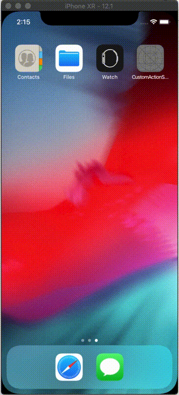

# CustomBottomSheet

CustomBottomSheet provide customized view with different action colors and animated logo.
CustomBottomSheet is an extensible library to quickly create custom action sheet controller.

## Getting Started

These instructions will get you a copy of the project up and running on your local machine for development and testing purposes. See deployment for notes on how to deploy the project on a live system.




### Prerequisites

* Xcode 10+
* Swift 4.2+

### Installing

Run Pod install

```
pod 'CustomBottomSheet', '~> 0.1.2'
```

And import

```
import CustomBottomSheet
```

## Usage

Create CustomBottomSheet variable

```
 var actionSheet: CustomBottomSheet!
```

### And initialise 

Initialise the CustomBottomSheet and pass required feilds and add it to the view

```
  actionSheet = CustomBottomSheet(frame: view.frame)
        actionSheet.colors = [.black,.black,.red]
        actionSheet.actionTitle = ["Report"]
        actionSheet.delegate = self
        actionSheet.buttonHeight = 64
        actionSheet.animationDuration = 0.7
        
        view.addSubview(actionSheet)
        actionSheet.setupViewElements()
```

### Hide CustomBottomSheet 

```
actionSheet.dismissSheet()
```

### Use protocol to recieve actions

```

extension ViewController: CustomBottomSheetDelegate{
    
    func customSheet(actionForItemAt index: Int) {
        
        switch index {
            
        case 0:
            print(index)

            break
            
        default:
            actionSheet.dismissSheet()
            break
        }
        
    }
}

```


## Authors

* **Narinder Singh** -  - [](https://github.com/nindipuri)

